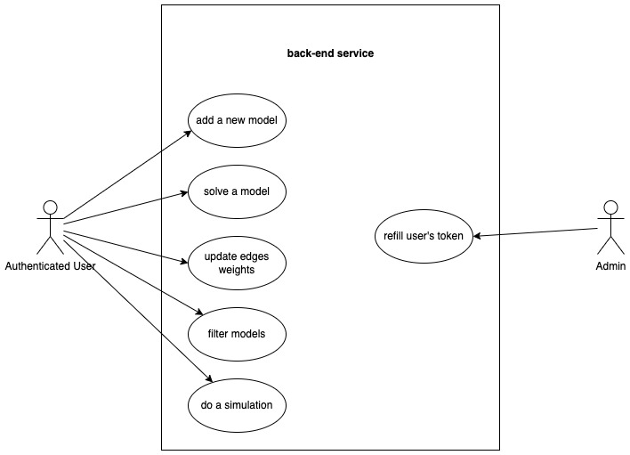
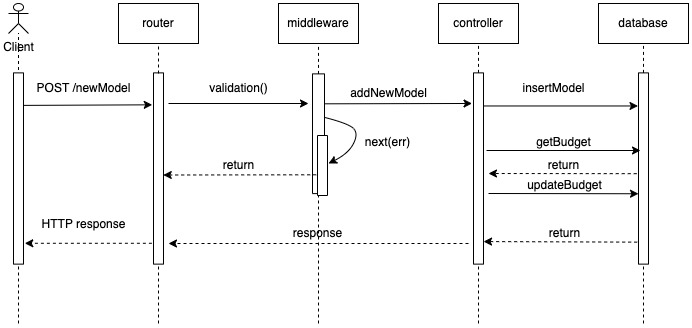
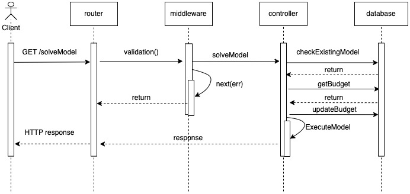
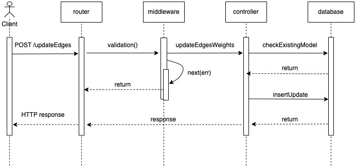
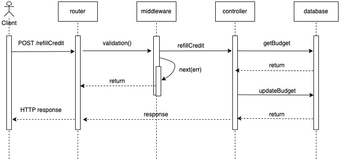
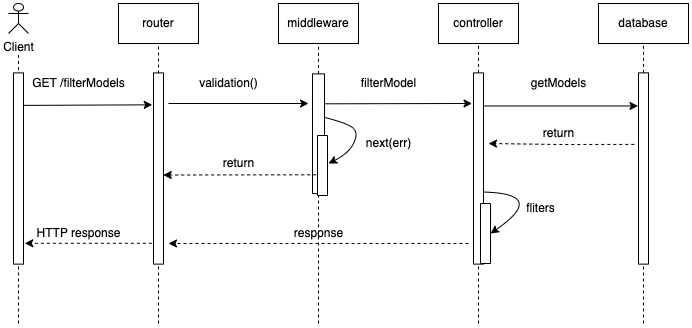
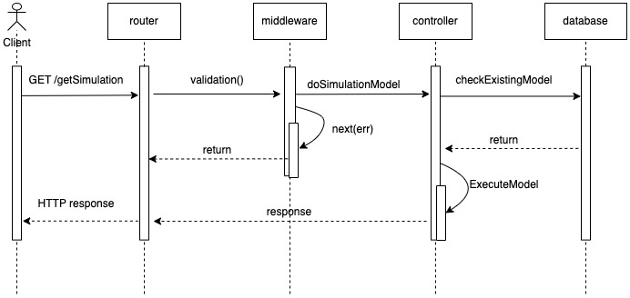

# ProgettoPA

# Obiettivi

L’obiettivo è quello di realizzare un back-end che consenta di gestire e valutare di modelli di ottimizzazione su grafo. In particolare il sistema deve prevedere la possibilità di gestire l’aggiornamento di pesi effettuato da utenti autenticati.
Nel dettaglio le richieste sono le seguenti:
- Dare la possibilità di creare un nuovo modello seguendo l’interfaccia definita nella sezione API di https://www.npmjs.com/package/node-dijkstra ed in particolare di specificare il grafo con i relativi pesi.
	- in particolare, è necessario validare la richiesta di creazione del modello
	- per ogni modello valido deve essere addebitato un numero di token in accordo con quanto segue: 0.15 per ogni nodo e 0.01 per ogni arco
	- il modello può essere creato se c’è credito sufficiente ad esaudire la richiesta.
	
- Eseguire il modello fornendo un nodo di partenza ed uno di arrivo, per ogni esecuzione deve essere applicato un costo pari a quello addebitato nella fase di creazione. Ritornare il risultato sotto forma di JSON. Il risultato deve anche considerare il tempo impiegato per l’esecuzione. L’esecuzione del modello deve prevedere ovviamente la necessità di specificare start, goal. Ritornare il percorso ed il costo associato a tale percorso.

- Gestire le richieste di cambio di peso per uno o più archi da parte degli utenti autenticati.
	- si procede con aggiornare il peso dell’arco mediante una media esponenziale del tipo p(i,j) = alpha * p(i,j) + (1 - alpha) * p_new(i,j) dove p(i,j) è il precedente costo associato all’arco che collega nodi i-j e p_new è il nuovo costo suggerito dall’utente. Alpha è uguale per tutti i modelli e deve essere gestito mediante una variabile di env. alpha deve essere > 0 e < 1; valori errati nella variabile di env devono determinare l’avvio del sistema con una configurazione pari ad alpha = 0.9

- Restituire l’elenco delle versioni dei pesi di un dato modello eventualmente filtrando per: data di modifica, numero di nodi, numero di archi.
- Effettuare una simulazione che consente di variare il peso relativo ad un arco specificando il valore di inizio, fine e passo di incremento:
	- le richieste di simulazione devono essere validate 
	- è necessario ritornare l’elenco di tutti i risultati; ritornare anche il best result con la relativa configurazione dei pesi che sono stati usati.

- le richieste devono essere validate.
- ogni utente autenticato (con JWT) ha un numero di token (valore iniziale impostato nel set del database)
- nel caso di token terminati ogni richiesta da parte dello stesso utente deve restituire 401 Unauthorized.
- Prevedere una rotta per l’utente con ruolo admin che consenta di effettuare la ricarica per un utente fornendo la mail ed il nuovo credito (sempre mediante JWT). I token JWT devono contenere i dati essenziali.
- Il numero residuo di token deve essere memorizzato del database sopra citato.
- Si deve prevedere degli script di seed per inizializzare il sistema. Nella fase di dimostrazione (demo) è necessario prevedere almeno due modelli diversi con almeno due versioni con una complessità minima di 8 nodi e 16 archi.
- Si chiede di utilizzare le funzionalità di middleware sollevando le opportune eccezioni.

---

# Progettazione
I requisiti prevedono l’utilizzo di un token JWT per ogni richiesta, in essi saranno contenuti i dati essenziali.\
In base all’utilizzo del sistema ci sono due tipologie di utilizzatori: utenti e admin. I token gestiti dai middleware saranno di due tipologie.\
Il token relativo all’utente contiene l’email dell’utente e il ruolo (che per l’utente è pari a 1):
```
{
  "email": "user@email.it",
  "role": "1",
  "iat": 1516239022
}
```
Il token relativo all’utente contiene l’email, il ruolo (che per l’admin è pari a 2), l’email dell’utente a cui deve fare la ricarica e il budget da aggiungere a tale utente.
```
{
  "email": "admin@email.it",
  "emailuser": "user@email.it",
  "role": "2",
  "budget": "100",
  "iat": 1516239022
}
```
## Richieste 

| Rotta            | Tipo | Autenticazione JWT |
| ---------------- | ---- | ------------------ |
| /newModel        | POST | SI                 |
| /solveModel      | POST | SI                 |
| /updateEdges     | POST | SI                 |
| /refillCredit    | POST | SI (ADMIN ONLY)    |
| /filterModels    | GET  | SI                 |
| /getSimulation   | GET  | SI                 |

### newModel
La prima rotta inserita è quella relativa all’inserimento di un nuovo modello nel database. \
```
{
"namemodel": "grafo_uno",
"nodes": { "A": { "B": 1, "C": 2 },
  "B": { "A": 1, "C": 3, "D": 2 },
  "C": { "A": 2, "B": 3, "D": 1, "E": 4 },
  "D": { "B": 2, "C": 1, "E": 3, "F": 2 },
  "E": { "C": 4, "D": 3, "F": 1, "G": 2 },
  "F": { "D": 2, "E": 1, "G": 3, "H": 4 },
  "G": { "E": 2, "F": 3, "H": 1 },
  "H": { "F": 4, 'G": 1 }
}
}
```
### solveModel
La seconda rotta inserita permette l’esecuzione del modello, l’utente deve inserire il nome del modello e la relativa versione.\
Un esempio di richiesta:
```
{
    "namemodel": "grafo_uno",
    "version": 1,
    "start": "A",
    "goal": "H"
}
```
### updateEdgesWeights
La terza rotta ha il compito di aggiornare il peso di uno o più archi, l'utente deve insierire il nome e la versione del modello in questione e gli archi (quindi un nodo e un suo vicino) con il peso da aggiornare.\
Un esempio di richiesta:
```
{
  "namemodel": "grafo_1",
  "version": 1,
  "edges": [
    {
      "node": "A",
      "neighbour": "B",
      "newWeight": 4
    },
    {
      "node": "A",
      "neighbour": "C",
      "newWeight": 3
    }
  ]
}
```
### refillCredit
La quarta rotta è quella che permette ad un admin di ricaricare il budget di un utente.\
Non presenta un body in quanto all'interno del token sono presenti tutte i dati necessari a tale operazione, ovvero l'email del ricevente, i token da aggiungere e il ruolo dell'admin stesso. 

### filterModels
La quinta rotta ha la funzionalità di filtrare le versioni di un modello presenti nel database, la scelta di filtraggio può essere eseguita in base alla data di creazione, al numero di nodi e al numero di archi.\
Un esempio di richiesta:
```
{
   "namemodel": "grafo_uno",
  "date": "7/10/2023",
  "numnodes": 8,
  "numedges": 16
}
```
### getSimulation
La sesta rotta permette di effettuare una simulazione cambiando il peso relativo ad un arco specificando il valore di inizio, fine e step.\
Quindi l'utente dovrà inserire il nome e la versione del modello, l'arco (quindi un nodo e un suo vicino) a cui si vuole far variare il peso, i valori di start, stop e step, e i nodi di inizio e fine per l'esecuzione del grafo.\
Un esempio di richiesta:
```
{
    "namemodel": "grafo_uno",
    "version": 1
    "node": "A",
    "neighbour": "B",
    "start": 1,
    "stop": 0.5,
    "step": 3,
    "startnode" "A",
    "endnode": "H"
}
```
---

# UML

Di seguito è riportato il diagramma dei casi d'uso:


Di seguito sono riportati i diagrammi delle sequenze delle varie chiamate:

- ### POST /newModel
  
- ### POST /solveModel
   
- ### POST /updateEdges
  
- ### POST /refillCredit
   
- ### GET /filterModels
   
- ### GET /getSimulation
   
   
---

# Pattern utilizzati

### VCM
Model-View-Controller è un Patter Architteturale, in particolare in questo progetto è stato usato un Model-Controller in quanto è stata implementata solo la parte di back-end. Il Model ha consentito la gestione dell'intero database e delle operazioni eseguite su di esso, mentre il Controller ha permesso la gestione dell'utente con l'applicazione.

### Singleton
Il Singleton fa parte dei Design Pattern Creazionale e assicura che una classe abbia un'unica istanza accessibile a livello globale.\
Questo pattern è stato utilizzato per instaurare una connessione con il database e garantire di lavorare sulla stessa instanza, così da evitare di avere connessioni multiple.

### Middleware
Il middleware è il livello intermedio responsabile della convalida delle richieste.\
Tutte le richieste passano attraverso la validazione del middleware per verificare la validità del token associato alla richiesta e la correttezza dei dati inseriti.

### Chain of Responsability
La CoR fa parte dei Design Pattern comportamentali e permette di processare una richiesta attraverso l'esecuzione di funzioni collegate tra loro in un determinato ordine.\
Tale pattern è stato utilizzato per filtrare le richieste HTTP in modo che al controller vengano inviate solo le richieste  corrette.\ 
Per ogni rotta è stata definita una catena di middleware composta da:
* middleware per il controllo dell'header e del token JWT;
* middleware specifici della rotta;

---

# Avvio del servizio
affinché il servizio possa essere avviato bisogna assicurarsi di avere l'ambiente Docker installato sulla propria macchina

Procedura di avvio:
- clonare la cartella presente nel repository e posizionarsi in essa
- nella cartella è presente un file variabiliAmbiente in cui ci sono le variabili d'ambiene da inserire in un file .env
- tra le variabili bisogna cambiare SECRET_KEY con la chiave usata per genererare i token JWT
- il valore di ALPHA può essere cambiato con un numero compreso tra 0 e 1
- dopo aver creato il file .env bisogna avviare docker con il seguente comando:
``` docker-compose up ```
- eseguire dei test sulla porta 8080 tramite Postman o cURL


## TEST

nella cartella è presente un file "Models.postman_collection.json" che può essere importato su Postman per eseguire i test.\
I token JWT sono stati realizzati tramite la chiave "mysecret".

---

## Framework/librerie 
- [Node.js](https://nodejs.org/it/)
- [Express](https://expressjs.com/it/)
- [Sequelize](https://sequelize.org/)
- [Postgres](https://postgresql.org/)
- [node-dijkstra](https://www.npmjs.com/package/node-dijkstra/)

## Software 
- [Visual Studio Code](https://code.visualstudio.com/)
- [Docker](https://www.docker.com/) 
- [Postman](https://www.postman.com/) 
